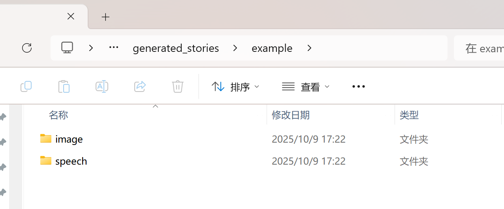

# MM-StoryAgent 60分总结

## 一、使用指南
#### 1.在仓库拉取dev分支的代码
#### 2.基础环境配置（pip或者anaconda）
   ```python
   # 这是pip的：
   pip install -r requirements.txt
   pip install -e .
   ```
#### 3.一个配置
  因为我阿里云语音api用不了，所以换成了edge-tts的语音合成服务，要下载（如果你愿意改代码可以不下载）：
   ```python
   pip install edge-tts
   # 测试：
   edge-tts --text "Hello, this is a test" --write-media test.mp3
   # 如果test.mp3文件生成成功，说明这个环境配置成功。
   ```
#### 4.安装ImageMagick
MoviePy需要ImageMagick来渲染字幕文字
1. 下载链接：https://imagemagick.org/script/download.php#windows
2. 选择（我的电脑下载这个，不同电脑可能不一样，问问ai）：
   `ImageMagick-7.x.x-Q16-HDRI-x64-dll.exe`  

3. 安装时勾选：`Install legacy utilities`
   
4. 改一个地方的代码：（只需要把文件路径改成你自己的就行）
    
    **修改文件：** `mm_story_agent/video_compose_agent.py`

    在文件开头的位置（第14-16行，改15行的路径）：

    ```python
    # 配置ImageMagick路径（用于字幕生成）
    IMAGEMAGICK_BINARY = r"D:\software\ImageMagick-7.1.2-Q16-HDRI\magick.exe"
    os.environ['IMAGEMAGICK_BINARY'] = IMAGEMAGICK_BINARY
    ```

5. 重启终端（记得需要重新设置环境变量--下面这步的↓）

#### 5.配置变量：
  每次打开终端要执行：
  ```python
  # 在PowerShell中运行
    $env:DASHSCOPE_API_KEY=*
    $env:ALIYUN_APP_KEY=*
    $env:ALIYUN_ACCESS_KEY_ID=*
    $env:ALIYUN_ACCESS_KEY_SECRET=*
  ```
  或者直接运行：
>```     .\setup_env.ps1    ```
#### 6.运行程序：
  **默认配置（num_outline=4）会生成约12张图片的视频，需要10-12分钟**。
  
  如果想快速测试（1分钟生成3张图片），请先按照 __"7.修改图片数量"__ 将 `num_outline` 改为 1 
  运行下面这个命令之前，最好先把原来的文字文件、图片、音频、视频都删了，只留下image和speech两个空文件夹。下面这样
  


  ```python
  python run.py -c configs/mm_story_agent_api.yaml
  ```

  
####  7.修改语言、主题、风格、图片数量：
##### 7.1方式一：脚本
修改故事主题风格等：编辑 language_config.yaml 中的 story_topic等就行
```yaml
language: "zh"  # 或 "en"

zh:
  story_topic: "您想要的故事主题"
  main_role: "主角描述"
  scene: "场景描述"
  voice: "zh-CN-XiaoxiaoNeural"
```
修改图片数还是按照7.2  
切换语言，执行：
```python
python switch_language.py zh # 切换为中文
python switch_language.py en # 切换为英文
```
然后生成故事，执行：
```python
python run.py -c configs/mm_story_agent_api.yaml
```
##### 7.2 方式二：配置文件
__1.修改主题：__
编辑 `configs/mm_story_agent_api.yaml` 文件的第15行左右：
```yaml
story_topic: "您想要的故事主题"
```

__2.修改图片数量__

编辑 `configs/mm_story_agent_api.yaml` 第12行的 `num_outline` 参数：

**⚠️ 说明：** 
- `num_outline` 控制的是**章节数**
- 每个章节会自动扩展成**约3页故事**
- **最终图片数 ≈ num_outline × 3**
- 每页故事 = 1张图片 + 1段语音 + 1段字幕

```yaml
num_outline: 1  # 1个章节 → 约3张图片，具体数量由AI决定，好像是（约3分钟，但是今天测试用了7分钟。。。）
num_outline: 4  # 4个章节 → 约12张图片（约10分钟，完整版）
```

**生成时间参考：**
- 3张图片（num_outline=1）：约3-5分钟
- 12张图片（num_outline=4）：约12分钟 ← **默认设置**

**提示：** 如果只是测试功能，建议先设置为1，成功后再改成4生成完整视频。

__3 修改语音风格__

编辑 `configs/mm_story_agent_api.yaml` 第25行：

```yaml
voice: en-US-AriaNeural     # 英文女声（默认）
voice: en-US-GuyNeural      # 英文男声
voice: zh-CN-XiaoxiaoNeural # 中文女声
```

查看所有可用语音：
```bash
edge-tts --list-voices
```

#### 8.查看结果：
    
生成的文件在 `generated_stories/example/` 目录：
```
    generated_stories/example/
    ├── image/          # 生成的图像（默认约12张，取决于num_outline设置）
    ├── speech/         # 语音文件
    ├── script_data.json  # 故事元数据
    └── output.mp4      # 最终视频 ⭐
```


## 二、代码修改总结（为了后面报告记录一下）
---

### 修改1：去除音乐和音效模块 

**原因：** 任务要求去除背景音乐和音效，只保留语音旁白。

**修改文件：（行数是新代码的）**

#### 1.1 `mm_story_agent/mm_story_agent.py`
```python
# 第18行：只保留image和speech两个模态
self.modalities = ["image", "speech"]  # 原来还包含 "sound", "music"
```

#### 1.2 `mm_story_agent/video_compose_agent.py`
- 第251行：注释掉 `sound_dir` 路径
- 第339-341行：移除音效轨道处理
- 第363-365行：移除背景音乐混音

#### 1.3 `configs/mm_story_agent_api.yaml`
- 删除了配置中的 `sound_volume` 和 `music_volume` 参数

**结果：** 视频只包含语音旁白，无背景音乐和音效。

---

### 修改2：图像生成改为API调用 

将本地Stable Diffusion模型改为API调用方式。

**原因：** Stable Diffusion模型要下载6GB，而且好像需要GPU，而且生成的慢（40min左右）。改为API调用可以加快生成速度，还不需要下载模型。

**修改文件：**

#### 2.1 `mm_story_agent/modality_agents/image_agent.py`
新增了 `DashScopeImageAgent` 类（第777-1021行）：
以下是部分代码（）
```python
@register_tool("dashscope_image_api")
class DashScopeImageAgent:
    """使用通义万相API生成图像"""
    
    def generate_image_from_prompt(self, prompt: str) -> Image.Image:
        import dashscope
        from dashscope import ImageSynthesis
        
        response = ImageSynthesis.call(
            model='wanx-v1',  # 通义万相模型
            prompt=prompt,
            n=1,
            size='1024*1024',
            api_key=self.api_key
        )
        # ... 下载并保存图像
```


#### 2.2 注册新工具（应该是全的吧）
- `mm_story_agent/base.py`：添加 `'dashscope_image_api': 'DashScopeImageAgent'`
- `mm_story_agent/__init__.py`：导出 `DashScopeImageAgent`
- `mm_story_agent/modality_agents/__init__.py`：添加到 `image_agent` 列表

#### 2.3 修改配置
`configs/mm_story_agent_api.yaml`：
```yaml
image_generation:
    tool: dashscope_image_api  # 从 story_diffusion_t2i 改为 API
```

---

### 修改3：语音合成改为免费Edge-TTS 

**原因：** 我的阿里云语音服务用不了了，改用微软Edge-TTS。

**优点：**
- ✅ 完全免费
- ✅ 无需API密钥
- ✅ 支持多语言
- ✅ 语音质量高
  
**修改文件：**

#### 3.1 `mm_story_agent/modality_agents/speech_agent.py`
新增 `EdgeTTSAgent` 类（第110-168行）：
部分代码：

```python
@register_tool("edge_tts")
class EdgeTTSAgent:
    """使用微软Edge-TTS的免费语音合成"""
    
    async def _synthesize(self, text: str, voice: str, output_file: str):
        import edge_tts
        communicate = edge_tts.Communicate(text, voice)
        await communicate.save(output_file)
```


#### 3.2 注册工具
- `mm_story_agent/base.py`：添加 `'edge_tts': 'EdgeTTSAgent'`
- `mm_story_agent/__init__.py`：导出 `EdgeTTSAgent`
- `mm_story_agent/modality_agents/__init__.py`：添加到 `speech_agent` 列表

#### 3.3 修改配置
`configs/mm_story_agent_api.yaml`：
```yaml
speech_generation:
    tool: edge_tts  # 从 cosyvoice_tts 改为 edge_tts
    params:
        voice: en-US-AriaNeural  # 英文女声
```

#### 3.4 安装依赖（前面步骤下载了就不用了）
```bash
pip install edge-tts
```

---

### 修改4：配置ImageMagick路径（字幕功能）

**原因：** MoviePy需要ImageMagick来渲染字幕文字。
**下载：** 按照前面的步骤
**修改文件：**`mm_story_agent/video_compose_agent.py`
在文件开头添加（第14-16行）：……


---

### 修改5：增加中文语言切换功能+修改主题描述等

**原因：** 原系统只支持英文故事生成，需要增加中文支持，并简化语言切换操作。

**主要功能：**
- 支持中文故事生成
- 支持中文字幕显示
- 支持中文语音合成
- 一键切换中英文模式
- 简化配置管理

**修改文件：**

#### 5.1 创建中文提示词文件
**新增文件：** `mm_story_agent/prompts_zh.py`
- 包含所有故事生成、图像描述、音效描述等的中文提示词
- 与原有的 `prompts_en.py` 对应，支持完整的中文故事生成流程

#### 5.2 更新所有模态代理使用中文提示词
**修改文件：**
- `mm_story_agent/modality_agents/story_agent.py` - 故事生成
- `mm_story_agent/modality_agents/image_agent.py` - 图像描述
- `mm_story_agent/modality_agents/music_agent.py` - 音乐描述
- `mm_story_agent/modality_agents/sound_agent.py` - 音效描述
- `mm_story_agent/modality_agents/freesound_agent.py` - 音效搜索

**修改内容：** 将所有 `from ...prompts_en import` 改为 `from ...prompts_zh import`

#### 5.3 创建语言切换脚本
**新增文件：** `switch_language.py`
```python
# 使用方法：
python switch_language.py zh  # 切换到中文模式
python switch_language.py en  # 切换到英文模式
```

**功能：**
- 自动更新所有代理文件的导入语句
- 自动更新配置文件中的故事主题、语音等参数
- 支持一键切换，无需手动修改多个文件

#### 5.4 创建语言配置文件
**新增文件：** `language_config.yaml`
```yaml
language: "zh"  # 当前语言模式

zh:
  story_topic: "森林男孩寻宝记"
  main_role: "一个勇敢的小男孩"
  scene: "神秘的大森林"
  voice: "zh-CN-XiaoxiaoNeural"
  prompts_file: "prompts_zh"

en:
  story_topic: "Time Management: A child learning how to manage their time effectively."
  main_role: "(no main role specified)"
  scene: "(no scene specified)"
  voice: "en-US-GuyNeural"
  prompts_file: "prompts_en"
```

#### 5.5 修复工具注册系统
**修改文件：** `mm_story_agent/base.py`
- 修复了 `import_from_register` 函数，确保所有工具能正确加载
- 解决了 `KeyError: 'qa_outline_story_writer'` 错误

#### 5.6 更新配置文件示例
**修改文件：**
- `configs/mm_story_agent.yaml`
- `configs/mm_story_agent_no_music.yaml`
- `configs/mm_story_agent_api.yaml`

**修改内容：** 将故事主题示例改为中文，语音配置适配中文

**使用方法：**
1. **修改故事主题**：编辑 `language_config.yaml`
2. **切换语言**：`python switch_language.py zh`
3. **生成故事**：`python run.py -c configs/mm_story_agent_api.yaml`

**结果：** 系统现在完全支持中文故事生成，包括中文故事内容、中文字幕、中文语音，并可以一键切换中英文模式。

## 四、项目文件结构

如果要读代码，建议问一下ai，先读哪个文件

```
MM_StoryAgent-main/
├── configs/
│   ├── mm_story_agent_api.yaml     # 主配置文件（API版本）
│   ├── mm_story_agent.yaml         # 完整版本配置
│   └── mm_story_agent_no_music.yaml # 无音乐版本配置
├── mm_story_agent/
│   ├── base.py                      # 工具注册（已修改）
│   ├── __init__.py                  # 模块导出（已修改）
│   ├── mm_story_agent.py            # 主流程（已修改）
│   ├── video_compose_agent.py       # 视频合成（已修改，需配置ImageMagick路径）
│   ├── prompts_zh.py                # 中文提示词（新增）
│   ├── prompts_en.py                # 英文提示词（原有）
│   └── modality_agents/
│       ├── __init__.py              # Agent导出（已修改）
│       ├── story_agent.py           # 故事生成（已修改为支持中文）
│       ├── image_agent.py           # 图像生成（新增DashScopeImageAgent）
│       ├── speech_agent.py          # 语音合成（新增EdgeTTSAgent）
│       ├── music_agent.py           # 音乐生成（已修改为支持中文）
│       ├── sound_agent.py           # 音效生成（已修改为支持中文）
│       ├── freesound_agent.py       # 音效搜索（已修改为支持中文）
│       └── llm.py                   # 大语言模型
├── generated_stories/
│   └── example/
│       ├── image/                   # 生成的图片
│       ├── speech/                  # 生成的语音
│       ├── script_data.json         # 故事数据
│       ├── captions.srt            # 字幕文件
│       └── output.mp4              # 最终视频 ⭐
├── language_config.yaml             # 语言配置文件（新增）
├── switch_language.py               # 语言切换脚本（新增）
├── 中文故事生成说明.md              # 中文使用说明（新增）
├── requirements.txt                 # Python依赖
└── run.py                           # 运行入口

⚠️ 需要修改的文件：
1. video_compose_agent.py - ImageMagick路径（改为你下载的路径）
2. language_config.yaml - 故事主题、语言模式等配置（推荐使用）
3. setup_env.ps1 - API密钥（可选，这个文件可以不管）

🎯 推荐使用方式：
1. 修改 language_config.yaml 中的故事主题
2. 运行 python switch_language.py zh 切换中文
3. 运行 python run.py -c configs/mm_story_agent_api.yaml 生成故事
```

---

## 五、完成度自检

### 60分任务清单

- [x] 环境搭建完成
- [x] 去除音乐音效模块
- [x] 图像生成改为API调用
- [x] 语音合成正常工作
- [x] 视频合成带字幕
- [x] 成功生成完整视频
- [x] **新增：支持中文语言切换**

### 核心功能验证

- [x] **主题输入** - 支持自定义故事主题
- [x] **故事生成** - 通过大语言模型生成分段故事
- [x] **图像生成** - 调用通义万相API生成配图
- [x] **语音合成** - 使用Edge-TTS生成旁白
- [x] **多媒体整合** - 生成带图片、语音、字幕的视频
- [x] **中文支持** - 支持中文故事生成、中文字幕、中文语音
- [x] **语言切换** - 一键切换中英文模式
- [x] **配置管理** - 简化的语言和主题配置
